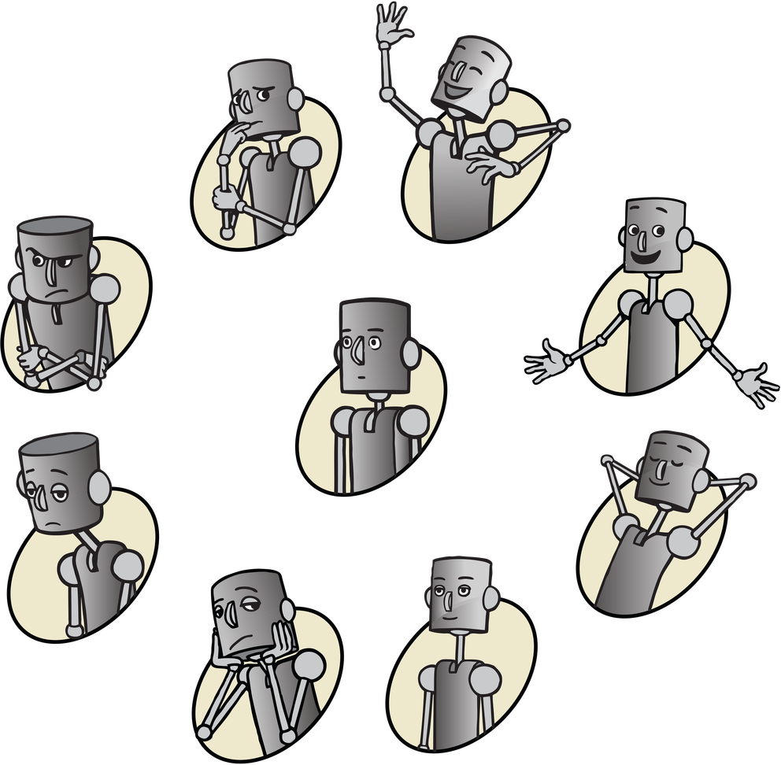

# Pick A Mood

This repository contains an implementation of [Pick a Mood](http://studiolab.ide.tudelft.nl/diopd/library/tools/pick-a-mood/) for jsPsych, which I created for a personal project.

## Atrribution
When using Pick A Mood please refer to and cite PAM's publication: Desmet, P. M. A., Vastenburg, M. H., & Romero, N. (2016). Mood measurement with Pick-A-Mood: Review of current methods and design of a pictorial self-report scale. Journal of Design Research, 14 (3), 241–279.

## License
The PAM characters can be used freely for non-commercial use under the Creative Commons Attribution-NonCommercial-NoDerivs 3.0 Unported License (more information: http://creativecommons.org/)
